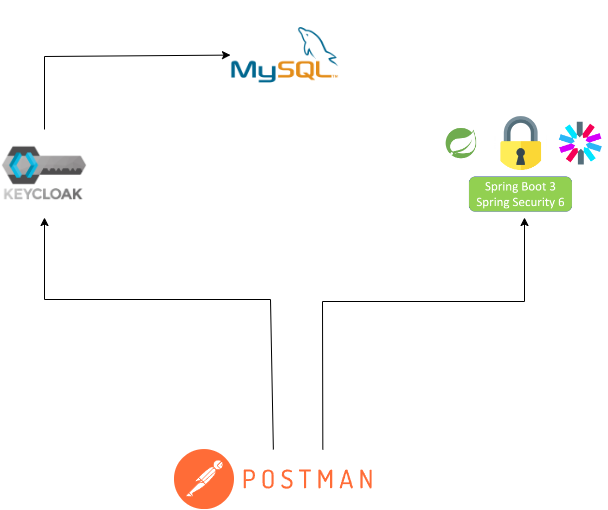

# Keycloak e Spring Boot + security + Client with postman
## Descrição
Esta é uma aplicação de exemplo que demonstra a integração de autenticação e autorização com o Keycloak e o uso do Spring Boot Security em uma aplicação Spring Boot simples.

## Configuração do Docker e Keycloak
1. Certifique-se de ter o Docker e o Docker Compose instalados em seu sistema.
2. Execute o seguinte comando para iniciar o Keycloak:


### docker-compose up -d
Isso criará um contêiner Docker com o Keycloak, onde você pode configurar seu Realm e gerenciar usuários e permissões.

## Configuração do Keycloak
1. Acesse o painel de administração do Keycloak em `http://localhost:8080/auth`.
2. Faça login com as credenciais padrão (geralmente admin/admin).
3. Crie um novo Realm e configure seus clientes, usuários, grupos e permissões de acordo com suas necessidades.
4. Ou utlize o exemplo que já está criado e faz a importação automática através do docker compose que está na pasta keycloak/import-realm.json
## Configuração da Aplicação Spring Boot
1. Abra a aplicação Spring Boot em sua IDE preferida.
2. Configure as propriedades de conexão com o Keycloak no arquivo `application.properties`
3. Pré configuramos as regras de segurança e autorização no código-fonte da aplicação, usando o Spring Boot Security.

## Uso
1. Use o Postman ou outra ferramenta de sua escolha para fazer uma solicitação de token JWT ao Keycloak, passando as credenciais do usuário.
2. Obtenha o token JWT gerado pelo Keycloak.
3. Use o token JWT para fazer solicitações à aplicação Spring Boot, passando-o como um cabeçalho de autorização. O Spring Boot Security verificará as permissões e autorizações antes de processar a solicitação.

## Exemplo de Solicitação de Token
Você pode usar o seguinte comando cURL como exemplo para solicitar um token JWT do Keycloak:

```bash
curl --location 'http://localhost:8080/auth/realms/examples/protocol/openid-connect/token' \
--header 'Content-Type: application/x-www-form-urlencoded' \
--header 'Cookie: JSESSIONID=67A76641902FEA07910D0DCE79CE2B97.ced48736f172; JSESSIONID=2B94FD3CA458A1744E7116B2ABC2CD55; JSESSIONID=67A76641902FEA07910D0DCE79CE2B97.d105afa4be2d' \
--data-urlencode 'client_id=seu-cliente' \
--data-urlencode 'grant_type=password' \
--data-urlencode 'client_secret=seu-segredo' \
--data-urlencode 'scope=openid' \
--data-urlencode 'username=user' \
--data-urlencode 'password=user'
```

### Exemplo de Solicitação à Aplicação Spring Boot

Após obter um token JWT, você pode usá-lo para fazer solicitações à sua aplicação Spring Boot. Certifique-se de incluir o token como cabeçalho de autorização no seguinte formato:


```bash
curl --location 'localhost:9999/keycloak/write-rule' \
--header 'Authorization: Bearer seu token'
```

```bash
curl --location 'localhost:9999/keycloak/read-rule' \
--header 'Authorization: Bearer seu token'
```

